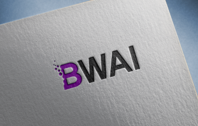

# BWAI

> 차세대 AI를 통한 비속어 필터링

<p></p>

기존 금칙어 사전 시스템을 통한 욕설 필터링의 문제점을 파악하여 AI를 도입한 차세대 비속어 필터링

## Needs

- Python 3.7.X
- MongoDB 4.X

## Installation

OS X & Linux:

```sh
git clone https://git.swmgit.org/swmaestro/bwai.git
```

Windows:

```sh
git clone https://git.swmgit.org/swmaestro/bwai.git
```

Development setup:

```sh
# 환경 변수 추가
nano /etc/profile

# 다음 내용을 추가
# FLASK ##############################################################
export FLASK_CONFIG=development
export FLASK_ENV=development
export FLASK_APP=manage:application
# BWAI ###############################################################
export BWAI_SECRET_KEY="BWAI JWT KEY IS TOO HARD"
export BWAI_ADMIN_ID="BWAI"
export BWAI_ADMIN_PW="bwaiisbest"
export BWAI_MONGODB_URI="mongodb://<mongo_url>@localhost:27017"
export BWAI_ERROR_LOG_PATH="./server.error.log"
```

## Usage example

**BWAI help:**

```shell
flask --help # Show BWAI flask cammand
```

BWAI Flask의 실행 가능한 명령어 들을 보여줍니다.


**BWAI db-init:**

```shell
flask db-init # BWAI Database init
```

BWAI Flask의 실행에 필요한 초기 Database를 설정합니다.


**BWAI routes:**

```shell
flask routes # Show BWAI API Routes
```

BWAI 의 사용 가능 한 API를 보여줍니다.


**BWAI test:**

```shell
flask test # BWAI Flask test run
```

BWAI 에 구현 된 API를 전체 테스트 합니다.


**BWAI Run:**

```shell
flask run # BWAI RUN !
```


BWAI Server 실행.

## Release History

* 0.0.1
  * Work in progress

## Meta

🙋🏻‍♂️ Name: Team BWAI

📧 E-mail: 

📔 Page: http://bwai.io

🐱 Github: https://git.swmgit.org/swmaestro/bwai

## Contributing

1. Fork it (<https://git.swmgit.org/swmaestro/bwai>)
2. Create your feature branch (`git checkout -b feature/fooBar`)
3. Commit your changes (`git commit -am 'Add some fooBar'`)
4. Push to the branch (`git push origin feature/fooBar`)
5. Create a new Pull Request